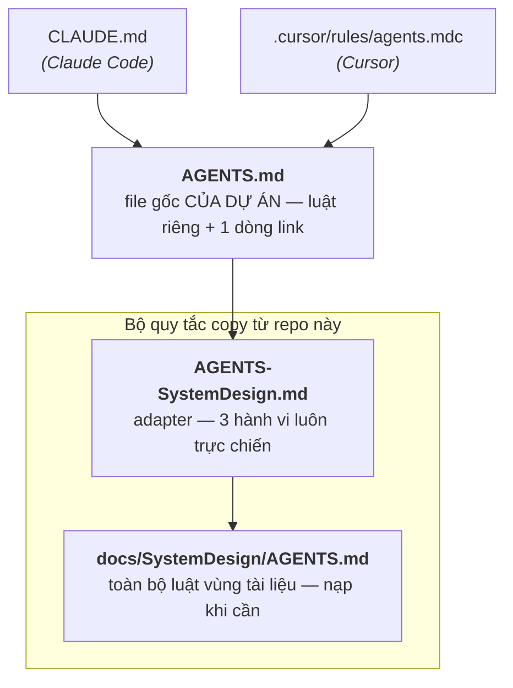

# ai-cowork-sysdev

Suy nghĩ và quy ước về phát triển hệ thống với sự hỗ trợ của AI:

- Cách làm việc với AI cho SE / Bridge SE trong giai đoạn thiết kế hệ thống (requirement → basic design).
- Quy trình phát triển (mức cao) và các tiện ích AI (skill…) sẽ bổ sung dần.

## Quick start — áp dụng vào dự án của bạn

Copy **2 file** sau vào repo dự án, giữ nguyên tên và đường dẫn:

| File | Copy vào dự án | Vai trò |
|---|---|---|
| [AGENTS-SystemDesign.md](AGENTS-SystemDesign.md) | `AGENTS-SystemDesign.md` (root) | Adapter: 3 hành vi luôn trực chiến (trigger vào vùng docs, đề nghị ghi quyết định, chốt an toàn `agreed-customer`) + trỏ tới quy tắc chi tiết |
| [docs/SystemDesign/AGENTS.md](docs/SystemDesign/AGENTS.md) | `docs/SystemDesign/AGENTS.md` | Toàn bộ quy tắc vùng tài liệu thiết kế (tự đứng trọn vẹn): cấu trúc thư mục, đọc/ghi index-first, chuyển đổi, ADR, sơ đồ, status |

Rồi **nối vào hệ luật có sẵn của dự án** — thêm 1 dòng vào `AGENTS.md` của dự án (xem [AGENTS.md](AGENTS.md) của repo này làm ví dụ):

> Đọc và tuân theo [AGENTS-SystemDesign.md](AGENTS-SystemDesign.md).

Chuỗi nạp khi AI mở repo:

Tên file `AGENTS-SystemDesign.md` cố ý khác `AGENTS.md` để không đụng file sẵn có của dự án; nâng cấp quy ước sau này chỉ là copy đè 2 file, không đụng vào luật riêng của dự án.

Dự án **chưa có** instruction file nào? — copy thêm [AGENTS.md](AGENTS.md) cùng các file con trỏ cho tool bạn dùng: [CLAUDE.md](CLAUDE.md) (Claude Code), [.cursor/rules/agents.mdc](.cursor/rules/agents.mdc) (Cursor).

**Sau đó không cần chuẩn bị gì thêm:** khi bạn đưa tri thức spec đầu tiên cho AI, nó sẽ tự dựng khung `docs/SystemDesign/` (README index + các category cần thiết) theo quy tắc đã định — bạn chỉ bàn luận, cung cấp thông tin và review diff.

## Tài liệu nền

- [docs/AiAssistant/AiAssistant.md](docs/AiAssistant/AiAssistant.md) — quy ước làm việc **cho con người** (SE nắm dự án): vì sao, triết lý, 5 quy tắc phải thuộc, quy trình chuyển đổi tài liệu, rủi ro. Kèm slide giới thiệu cho team ([bản tiếng Việt](docs/AiAssistant/AiAssistant-team-intro.pptx) / [日本語版](docs/AiAssistant/AiAssistant-team-intro.ja.pptx)).
- [docs/SystemDesign/](docs/SystemDesign/README.md) — **example** với dự án giả tưởng (hệ thống đặt phòng họp MRB), minh họa cấu trúc tài liệu, dòng status, ADR gọn, danh sách chỗ mờ… Xem để hình dung kết quả; không copy sang dự án thật.
- [docs/DevProcess.md](docs/DevProcess.md) — khung quy trình phát triển mức cao (tài liệu sống).
