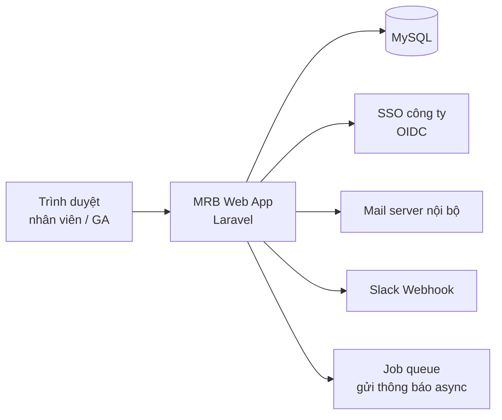

# BD-01 — Kiến trúc tổng thể

> Status: agreed-internal

## 1. Sơ đồ thành phần

## 2. Tech stack

| Lớp | Lựa chọn | Ghi chú |
|---|---|---|
| Backend | Laravel 12 (PHP) | Đồng bộ với stack các dự án nội bộ khác |
| Frontend | Blade + Alpine.js | Không SPA — xem Quyết định QD-01 |
| Database | MySQL 8 | Hạ tầng có sẵn |
| Thông báo | Queue (database driver) → mail + Slack | Gửi async để không chặn thao tác đặt phòng |

## 3. Quyết định

### QD-01 — Monolith + Blade, không SPA

- **Bối cảnh:** team 3 dev, quen Laravel; hệ thống CRUD + lịch, không có tương tác realtime phức tạp; NFR hiệu năng thấp (~30 người đồng thời).
- **Quyết định:** monolith Laravel, render phía server bằng Blade, Alpine.js cho tương tác nhỏ. Không dùng SPA (React/Vue) riêng.
- **Hậu quả:** phát triển và vận hành đơn giản, một codebase; đổi lại, nếu sau này cần UI lịch kéo-thả phức tạp sẽ phải đánh giá lại phần frontend — chấp nhận.

### QD-02 — Thông báo gửi qua queue

- **Bối cảnh:** gửi mail + Slack đồng bộ làm thao tác đặt phòng chậm và dễ lỗi lây (mail server chập chờn).
- **Quyết định:** mọi thông báo đi qua job queue; thao tác nghiệp vụ commit xong là trả kết quả cho người dùng.
- **Hậu quả:** thông báo có thể trễ vài giây; cần giám sát queue — chấp nhận, đổi lấy UX đặt phòng ổn định.
