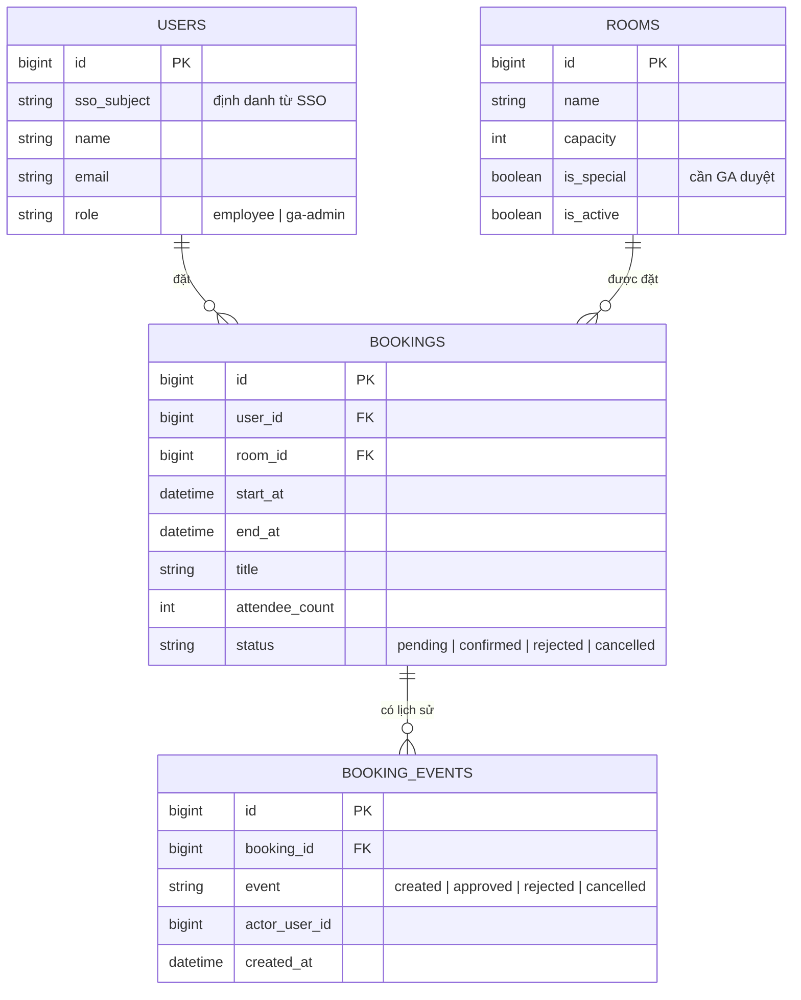

# BD-02 — Thiết kế database

> Status: agreed-internal

## 1. Sơ đồ ER

## 2. Ghi chú thiết kế

- **Chặn đặt trùng (FR-02):** ràng buộc kiểm tra ở tầng service + unique-range check trong transaction; không dựa vào UI.
- **`BOOKING_EVENTS`** là lịch sử bất biến (append-only) — phục vụ audit và báo cáo FR-07; không update/delete.
- Booking phòng thường tạo ra ở trạng thái `confirmed` ngay; phòng đặc biệt tạo ở `pending` (xem [BD-03](BD-03-BookingFlows.md)).

## 3. Câu hỏi chưa chốt

- Giữ dữ liệu 2 năm (ràng buộc SR-01 mục 3): xóa cứng hay archive sang bảng riêng? — cần bàn với GA về nhu cầu tra cứu quá 2 năm.
