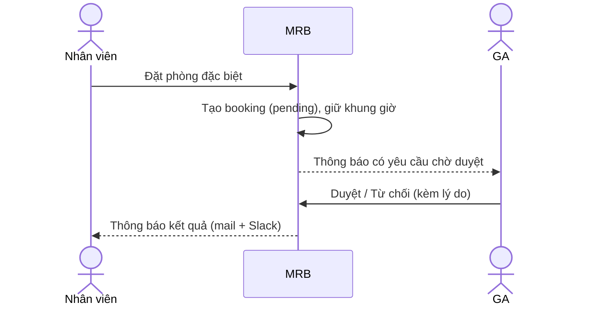

# BD-03 — Luồng đặt phòng và duyệt

> Status: draft

## 1. Luồng duyệt phòng đặc biệt (FR-04)

Bảng bước là **spec chính thức**; sơ đồ bên dưới là hình minh họa.

| Bước | Ai thực hiện | Hành động | Kết quả |
|---|---|---|---|
| 1 | Nhân viên | Đặt phòng đặc biệt | Booking tạo ở trạng thái `pending`; thông báo gửi GA |
| 2 | GA | Duyệt hoặc từ chối (kèm lý do khi từ chối) | `pending` → `confirmed` hoặc `rejected` |
| 3 | Hệ thống | Gửi thông báo kết quả cho người đặt (mail + Slack, qua queue) | Người đặt biết kết quả |
| 4 | Nhân viên | (Nếu bị từ chối) đặt lại phòng khác hoặc thời gian khác | Quay lại bước 1 với phòng thường hoặc đặc biệt |

Trong lúc booking còn `pending`, khung giờ đó **được giữ chỗ** — người khác không đặt trùng được.

## 2. Chỗ mờ từ buổi chuyển đổi tài liệu GA (2026-08-15)

Các điểm bản gốc (spreadsheet của GA) không nói rõ, đang chờ xác nhận — **chưa được coi là spec**:

- Booking `pending` quá 24h không ai duyệt thì tự hủy hay giữ nguyên? (bản gốc chỉ ghi "GA xử lý sớm")
- GA từ chối có bắt buộc nhập lý do không, hay tùy chọn? (bảng flow của GA vẽ nhánh này bằng ghi chú tay, không đọc được rõ)
