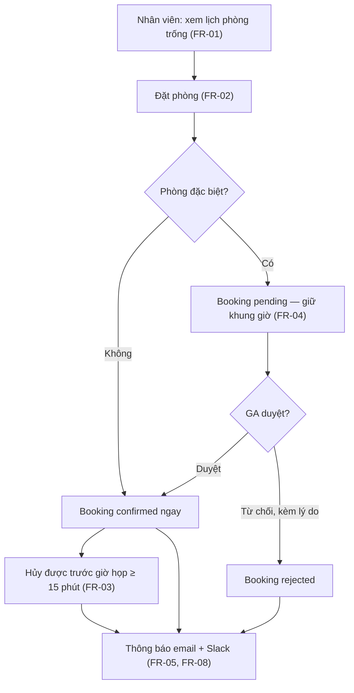

# SR — Yêu cầu hệ thống MRB

## Tổng quan

Hệ thống đặt phòng họp nội bộ, thay thế quy trình đặt qua bảng Excel chung. Người dùng là toàn bộ nhân viên; quản trị bởi bộ phận Tổng vụ (GA). Khách hàng (bộ phận GA) đã chốt danh sách yêu cầu chức năng ngày 2026-08-10.

## Luồng nghiệp vụ chính

Sơ đồ định hướng — chi tiết từng yêu cầu xem [SR-01](SR-01-FunctionalRequirements.md) (spec chính thức là text):

Ngoài luồng chính: GA quản lý danh mục phòng (FR-06) và xem báo cáo tỷ lệ sử dụng hằng tháng (FR-07).

## Thuật ngữ

| Thuật ngữ | Nghĩa |
|---|---|
| **Booking** | Một lượt đặt phòng: phòng + khoảng thời gian + người đặt |
| **Phòng đặc biệt** | Phòng cần GA duyệt trước khi booking có hiệu lực (phòng khách VIP, phòng hội nghị lớn) |
| **GA** | General Affairs — bộ phận Tổng vụ, vai trò quản trị |

## Mục lục

| File | Nội dung | Đọc khi nào |
|---|---|---|
| [SR-01-FunctionalRequirements.md](SR-01-FunctionalRequirements.md) | Yêu cầu chức năng + ràng buộc khách hàng đã chốt | Làm bất kỳ tính năng nào |
| [SR-02-NonFunctionalRequirements.md](SR-02-NonFunctionalRequirements.md) | Hiệu năng, bảo mật, vận hành | Thiết kế kiến trúc, hạ tầng, review bảo mật |
